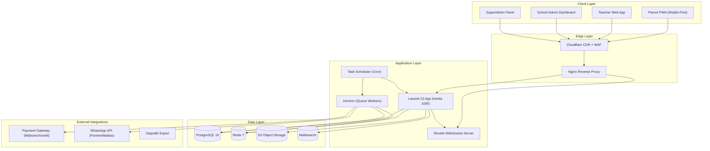
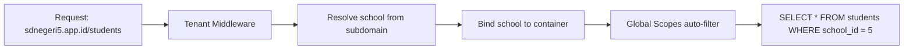
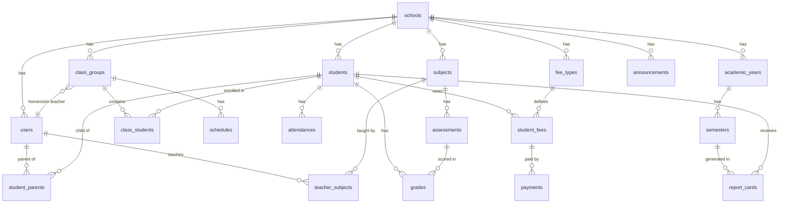
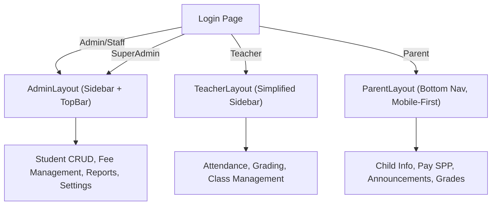
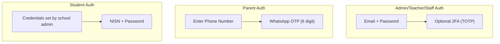
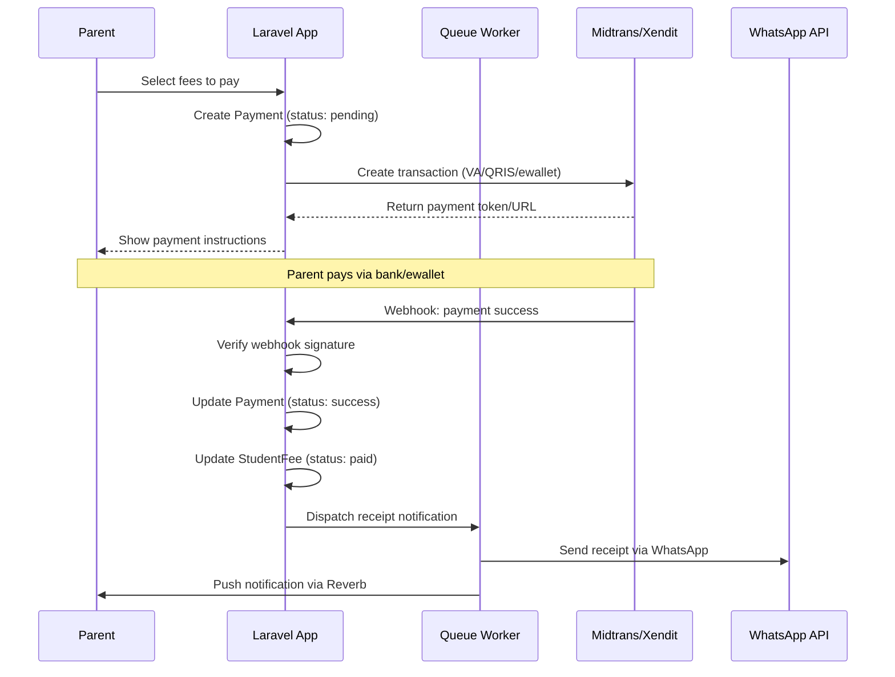
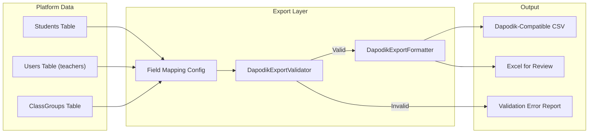
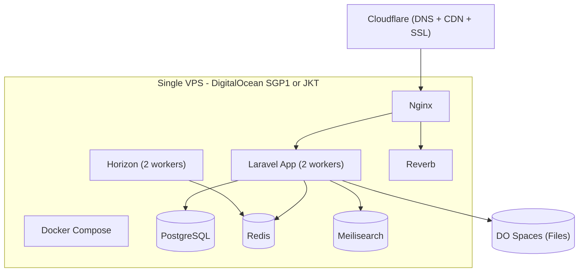
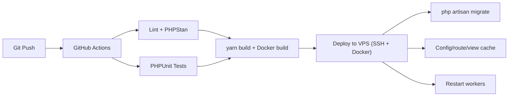

# School Management SaaS Platform - Architecture Document

> **Version:** 1.0
> **Last Updated:** 16 February 2026
> **Author:** Zulfikar Hidayatullah
> **Status:** Approved for Development

---

## Table of Contents

1. [Executive Summary](#1-executive-summary)
2. [Tech Stack](#2-tech-stack)
3. [System Architecture](#3-system-architecture)
4. [Multi-Tenancy Architecture](#4-multi-tenancy-architecture)
5. [Database Architecture](#5-database-architecture)
6. [Backend Code Organization](#6-backend-code-organization)
7. [Frontend Architecture](#7-frontend-architecture)
8. [Authentication & Authorization](#8-authentication--authorization)
9. [Integration Architecture](#9-integration-architecture)
10. [Performance & Scalability](#10-performance--scalability)
11. [Infrastructure & Deployment](#11-infrastructure--deployment)
12. [Security Architecture](#12-security-architecture)
13. [Edge Cases & Resilience](#13-edge-cases--resilience)
14. [Testing Strategy](#14-testing-strategy)
15. [Monitoring & Operations](#15-monitoring--operations)
16. [Implementation Roadmap](#16-implementation-roadmap)

---

## 1. Executive Summary

A multi-tenant SaaS platform for Indonesian school management (SD, SMP, SMA, SMK), built as a **modular monolith** using Laravel 12 + Vue 3 + Inertia.js. The platform serves three primary user types — school administrators, teachers, and parents — with role-specific interfaces optimized for their devices and workflows.

### Key Architectural Decisions

| Decision | Choice | Rationale |
|----------|--------|-----------|
| Architecture | Modular Monolith | Simple deployment, single codebase, extract services later only if needed |
| Multi-tenancy | Single DB + `school_id` scoping | Simpler operations, easier cross-tenant queries for SuperAdmin |
| Frontend | Vue 3 + Inertia (not Filament) | Unified UX across all roles, full design control |
| Routing | Wayfinder | Type-safe route generation, officially supported replacement for Ziggy |
| Mobile | PWA | No app store friction, single codebase, offline support |
| Parent Auth | WhatsApp OTP | Most Indonesian parents don't have email |

### Design Principles

- **Mobile-first for parents** — budget Android phones (Redmi 9-class) are the primary target
- **Pragmatic service pattern** — not over-engineered, no unnecessary abstraction layers
- **Indonesian market context** — Rupiah currency, WIB timezone, Bahasa Indonesia UI, Dapodik compatibility
- **Data isolation is non-negotiable** — single missed tenant scope = data breach

---

## 2. Tech Stack

### Backend

| Technology | Version | Purpose |
|-----------|---------|---------|
| Laravel | 12 | PHP framework |
| PHP | 8.3+ | Runtime |
| PostgreSQL | 16 | Primary database (JSONB, partitioning) |
| Redis | 7 | Cache, sessions, queue broker |
| Laravel Horizon | — | Queue dashboard |
| Laravel Reverb | — | WebSocket server (real-time notifications) |
| Meilisearch | — | Full-text search (students, documents) |
| S3-compatible | — | File storage (MinIO dev, DO Spaces / AWS S3 prod) |
| DomPDF | — | PDF generation (rapor, receipts) |
| Wayfinder | — | Type-safe route generation for Vue |

### Frontend

| Technology | Purpose |
|-----------|---------|
| Vue 3 + TypeScript | UI framework |
| Inertia.js (SSR enabled) | SPA-like experience without separate API |
| Tailwind CSS 4 | Styling |
| Reka UI | Headless, accessible UI primitives |
| TanStack Table (Vue) | Headless data tables, virtualizable |
| motion-vue | Animations (used sparingly for low-end devices) |
| @vueuse/core | Vue composables |
| dayjs (locale: id) | Date handling |
| Chart.js + vue-chartjs | Dashboard charts |

### Key Laravel Packages

| Package | Purpose |
|---------|---------|
| `stancl/tenancy` | Multi-tenancy (single-DB mode, subdomain resolution) |
| `spatie/laravel-permission` | Roles and permissions |
| `spatie/laravel-media-library` | File uploads with conversions |
| `spatie/laravel-activitylog` | Audit trail (critical for financial data) |
| `spatie/laravel-data` | Typed DTOs |
| `maatwebsite/laravel-excel` | Bulk Excel import/export |
| `laravel/pennant` | Feature flags (gradual rollout) |
| `spatie/laravel-backup` | Automated backups |
| `based/laravel-typescript` | Auto-generate TypeScript types from Eloquent models |

### Rejected Alternatives

| Alternative | Why Rejected |
|------------|--------------|
| Filament | Rejected per preference; trade-off is more frontend dev time, but unified UX. Mitigated by reusable Vue table/form components. |
| Ziggy | Replaced by Wayfinder (type-safe, officially supported) |
| Nuxt/Next.js | Inertia is correct — no need for separate API layer, simpler monolith |
| React Native / Flutter | PWA is the right call. No app store friction. Add Capacitor later if needed. |

---

## 3. System Architecture

### High-Level Overview



### Layer Descriptions

| Layer | Components | Responsibility |
|-------|-----------|----------------|
| **Client** | PWA, Web Apps | User interfaces per role |
| **Edge** | Cloudflare, Nginx | CDN, WAF, SSL termination, reverse proxy |
| **Application** | Laravel, Horizon, Scheduler, Reverb | Business logic, background jobs, real-time events |
| **Data** | PostgreSQL, Redis, S3, Meilisearch | Persistence, caching, file storage, search |
| **External** | Midtrans, Fonnte, Dapodik | Payments, messaging, government data export |

---

## 4. Multi-Tenancy Architecture

### Strategy: Single Database + `school_id` Scoping

Using `stancl/tenancy` in single-database mode with subdomain-based tenant resolution.



### Implementation Details

| Aspect | Implementation |
|--------|---------------|
| **Tenant Resolution** | Subdomain-based (`{school_slug}.platform.id`). `InitializeTenancyBySubdomain` middleware resolves school and binds to container. |
| **Data Isolation** | Every tenant model uses `BelongsToTenant` trait with global scope filtering by `school_id`. Auto-sets `school_id` on creation. |
| **Queue Context** | stancl/tenancy auto-tags queued jobs with current tenant. |
| **Cache Isolation** | Keys auto-prefixed with `tenant_{school_id}_` to prevent cross-tenant pollution. |
| **SuperAdmin** | Routes on main domain (`admin.platform.id`) without tenancy middleware. Can impersonate any school. |

### Table Classification

**Shared Tables (no `school_id`):**
- `provinces`, `districts`, `religions`, `curriculum_templates`, `subscription_plans`

**Tenant Tables (has `school_id`):**
- `users`, `students`, `attendances`, `payments`, and all other domain tables

### BelongsToSchool Trait (Data Isolation)

```php
// app/Models/Concerns/BelongsToSchool.php
trait BelongsToSchool
{
    public static function bootBelongsToSchool(): void
    {
        static::addGlobalScope('school', function (Builder $builder) {
            $builder->where(
                $builder->getModel()->qualifyColumn('school_id'),
                tenant('id')
            );
        });

        static::creating(function (Model $model) {
            if (!$model->school_id) {
                $model->school_id = tenant('id');
            }
        });
    }
}
```

> **CRITICAL:** Every query MUST go through this scope. A CI test scans all Eloquent models to verify tenant models use this trait. A single missed scope = data breach.

---

## 5. Database Architecture

### Entity Relationship Diagram (Core Phase 1)



### Key Schema Designs

#### 5.1 Students Table (JSONB for Flexible Data)

```sql
CREATE TABLE students (
    id BIGSERIAL PRIMARY KEY,
    school_id BIGINT NOT NULL REFERENCES schools(id),
    nisn VARCHAR(20),
    nik VARCHAR(20),
    name VARCHAR(255) NOT NULL,
    birth_date DATE,
    gender VARCHAR(1) CHECK (gender IN ('L', 'P')),
    religion VARCHAR(20),
    address TEXT,
    photo_path VARCHAR(500),
    status VARCHAR(20) DEFAULT 'active',
    family_data JSONB DEFAULT '{}',
    health_data JSONB DEFAULT '{}',
    metadata JSONB DEFAULT '{}',
    created_at TIMESTAMP DEFAULT NOW(),
    updated_at TIMESTAMP DEFAULT NOW()
);

CREATE INDEX idx_students_school ON students(school_id);
CREATE INDEX idx_students_school_status ON students(school_id, status);
CREATE INDEX idx_students_nisn ON students(school_id, nisn);
```

> `family_data`, `health_data`, and `metadata` use JSONB because family data structures vary wildly between schools. School-specific custom fields go into `metadata`.

#### 5.2 Attendances Table (Hottest Table)

```sql
CREATE TABLE attendances (
    id BIGSERIAL PRIMARY KEY,
    school_id BIGINT NOT NULL,
    student_id BIGINT NOT NULL,
    class_group_id BIGINT NOT NULL,
    subject_id BIGINT,
    date DATE NOT NULL,
    status VARCHAR(10) NOT NULL,
    marked_by BIGINT NOT NULL,
    notes TEXT,
    created_at TIMESTAMP DEFAULT NOW()
);

-- Prevent duplicate attendance records
CREATE UNIQUE INDEX idx_attendance_unique
    ON attendances(school_id, student_id, date, subject_id)
    WHERE subject_id IS NOT NULL;
CREATE UNIQUE INDEX idx_attendance_unique_daily
    ON attendances(school_id, student_id, date)
    WHERE subject_id IS NULL;

-- Query: "all attendance for class X on date Y"
CREATE INDEX idx_attendance_class_date
    ON attendances(school_id, class_group_id, date);
```

> `subject_id` is NULL for SD/TK (daily attendance) and populated for SMP/SMA (per-subject attendance).

#### 5.3 Payment Tables (Financial Integrity)

```sql
CREATE TABLE student_fees (
    id BIGSERIAL PRIMARY KEY,
    school_id BIGINT NOT NULL,
    student_id BIGINT NOT NULL,
    fee_type_id BIGINT NOT NULL,
    amount DECIMAL(15,2) NOT NULL,
    due_date DATE NOT NULL,
    status VARCHAR(20) DEFAULT 'unpaid',
    academic_year_id BIGINT NOT NULL,
    month INT,
    created_at TIMESTAMP DEFAULT NOW(),
    updated_at TIMESTAMP DEFAULT NOW()
);

CREATE TABLE payments (
    id BIGSERIAL PRIMARY KEY,
    school_id BIGINT NOT NULL,
    student_fee_id BIGINT NOT NULL,
    amount DECIMAL(15,2) NOT NULL,
    payment_method VARCHAR(50),
    gateway_provider VARCHAR(20),
    gateway_transaction_id VARCHAR(100),
    gateway_response JSONB DEFAULT '{}',
    status VARCHAR(20) DEFAULT 'pending',
    paid_at TIMESTAMP,
    verified_by BIGINT,
    notes TEXT,
    created_at TIMESTAMP DEFAULT NOW(),
    updated_at TIMESTAMP DEFAULT NOW()
);

CREATE INDEX idx_payments_school_status ON payments(school_id, status);
CREATE INDEX idx_payments_gateway ON payments(gateway_provider, gateway_transaction_id);
```

### Indexing Strategy

All composite indexes MUST lead with `school_id` to ensure PostgreSQL uses the index for tenant-scoped queries.

### Future Partitioning

After year 1 with many schools, `attendances` and `payments` will grow fast. Plan for range partitioning by date:

```sql
CREATE TABLE attendances (...) PARTITION BY RANGE (date);

CREATE TABLE attendances_2026_1 PARTITION OF attendances
    FOR VALUES FROM ('2026-01-01') TO ('2026-07-01');
```

> Don't implement on Day 1. Add when a single table exceeds ~50M rows.

### Enum Strategy

PHP Backed Enums stored as VARCHAR (not integers — readable in DB, easy to debug):

```php
enum AttendanceStatus: string {
    case Present = 'present';
    case Sick = 'sick';
    case Permitted = 'permitted';
    case Absent = 'absent';
}

enum PaymentStatus: string {
    case Pending = 'pending';
    case Success = 'success';
    case Failed = 'failed';
    case Expired = 'expired';
    case Refunded = 'refunded';
}

enum StudentStatus: string {
    case Active = 'active';
    case Transferred = 'transferred';
    case Graduated = 'graduated';
    case DroppedOut = 'dropped_out';
}
```

---

## 6. Backend Code Organization

### Directory Structure (Domain-Organized, Pragmatic Service Pattern)

```
app/
├── Http/
│   ├── Controllers/
│   │   ├── Auth/
│   │   │   ├── LoginController.php
│   │   │   ├── OtpController.php              # WhatsApp OTP for parents
│   │   │   └── RegisterController.php
│   │   ├── Dashboard/
│   │   │   └── DashboardController.php
│   │   ├── Student/
│   │   │   ├── StudentController.php
│   │   │   └── StudentImportController.php
│   │   ├── Attendance/
│   │   │   └── AttendanceController.php
│   │   ├── Finance/
│   │   │   ├── FeeController.php
│   │   │   ├── PaymentController.php
│   │   │   └── PaymentWebhookController.php
│   │   ├── Communication/
│   │   │   ├── AnnouncementController.php
│   │   │   └── WhatsAppController.php
│   │   ├── Academic/
│   │   │   ├── ClassGroupController.php
│   │   │   ├── SubjectController.php
│   │   │   └── ScheduleController.php
│   │   ├── Grading/
│   │   │   ├── AssessmentController.php
│   │   │   └── GradeController.php
│   │   ├── Rapor/
│   │   │   └── RaporController.php
│   │   ├── Parent/
│   │   │   └── ParentDashboardController.php
│   │   └── SuperAdmin/
│   │       ├── SchoolController.php
│   │       └── SubscriptionController.php
│   ├── Middleware/
│   │   ├── EnsureSchoolActive.php
│   │   ├── CheckSubscription.php
│   │   └── TrackLastActive.php
│   └── Requests/
│       ├── Student/
│       │   ├── StoreStudentRequest.php
│       │   └── UpdateStudentRequest.php
│       ├── Attendance/
│       │   └── MarkAttendanceRequest.php
│       └── ...
│
├── Models/
│   ├── Concerns/
│   │   ├── BelongsToSchool.php
│   │   ├── HasAuditTrail.php
│   │   └── Searchable.php
│   ├── School.php
│   ├── User.php
│   ├── Student.php
│   ├── ClassGroup.php
│   ├── Subject.php
│   ├── Attendance.php
│   ├── Assessment.php
│   ├── Grade.php
│   ├── FeeType.php
│   ├── StudentFee.php
│   ├── Payment.php
│   ├── Announcement.php
│   ├── ReportCard.php
│   └── WhatsAppMessage.php
│
├── Services/
│   ├── AttendanceService.php
│   ├── PaymentService.php
│   ├── RaporGenerationService.php
│   ├── StudentImportService.php
│   ├── DashboardService.php
│   └── Integrations/
│       ├── Payment/
│       │   ├── PaymentGateway.php              # Interface
│       │   ├── MidtransGateway.php
│       │   └── XenditGateway.php
│       └── WhatsApp/
│           ├── WhatsAppProvider.php             # Interface
│           ├── FonnteProvider.php
│           └── WablasProvider.php
│
├── Enums/
│   ├── AttendanceStatus.php
│   ├── PaymentStatus.php
│   ├── StudentStatus.php
│   ├── UserRole.php
│   └── SchoolLevel.php
│
├── Jobs/
│   ├── GenerateRaporPdf.php
│   ├── SendWhatsAppMessage.php
│   ├── ProcessStudentImport.php
│   ├── SendPaymentReminders.php
│   └── ReconcilePayments.php
│
├── Events/
│   ├── StudentMarkedAbsent.php
│   ├── PaymentReceived.php
│   ├── RaporGenerated.php
│   └── AnnouncementPublished.php
│
├── Listeners/
│   ├── NotifyParentOfAbsence.php
│   ├── SendPaymentReceipt.php
│   └── BroadcastAnnouncement.php
│
├── Policies/
│   ├── StudentPolicy.php
│   ├── AttendancePolicy.php
│   ├── PaymentPolicy.php
│   └── AnnouncementPolicy.php
│
├── Notifications/
│   ├── Channels/
│   │   └── WhatsAppChannel.php
│   ├── AbsenceNotification.php
│   ├── PaymentReminderNotification.php
│   └── PaymentReceiptNotification.php
│
└── Observers/
    ├── PaymentObserver.php
    └── StudentObserver.php
```

### Controller-Service Pattern

Controllers stay thin — validate, authorize, delegate to service, return Inertia response:

```php
class AttendanceController extends Controller
{
    public function __construct(
        private AttendanceService $attendanceService
    ) {}

    public function store(MarkAttendanceRequest $request): RedirectResponse
    {
        $this->attendanceService->markBulk(
            classGroupId: $request->class_group_id,
            date: $request->date,
            records: $request->validated('attendance'),
        );

        return back()->with('success', 'Absensi berhasil disimpan.');
    }

    public function index(Request $request): InertiaResponse
    {
        return Inertia::render('Attendance/Index', [
            'classGroups' => fn () => ClassGroup::current()->with('homeroomTeacher')->get(),
            'todayAttendance' => fn () => $this->attendanceService->getTodaySummary(),
        ]);
    }
}
```

Services contain business logic but stay pragmatic:

```php
class AttendanceService
{
    public function markBulk(int $classGroupId, string $date, array $records): void
    {
        DB::transaction(function () use ($classGroupId, $date, $records) {
            foreach ($records as $record) {
                Attendance::updateOrCreate(
                    [
                        'student_id' => $record['student_id'],
                        'date' => $date,
                        'subject_id' => $record['subject_id'] ?? null,
                    ],
                    [
                        'class_group_id' => $classGroupId,
                        'status' => AttendanceStatus::from($record['status']),
                        'marked_by' => auth()->id(),
                        'notes' => $record['notes'] ?? null,
                    ]
                );
            }
        });

        // Dispatch notifications for absent students
        collect($records)
            ->filter(fn ($r) => $r['status'] === 'absent')
            ->each(fn ($r) => StudentMarkedAbsent::dispatch($r['student_id'], $date));
    }
}
```

---

## 7. Frontend Architecture

### Directory Structure

```
resources/js/
├── app.ts                          # Inertia app bootstrap
├── ssr.ts                          # SSR entry point
├── types/
│   ├── index.d.ts                  # Global types
│   ├── models.d.ts                 # Auto-generated from Laravel models
│   ├── inertia.d.ts                # Inertia shared data types
│   └── enums.ts                    # Mirror of PHP enums
├── Layouts/
│   ├── AdminLayout.vue             # Sidebar + topbar for admin/staff
│   ├── TeacherLayout.vue           # Simplified for teachers
│   ├── ParentLayout.vue            # Bottom nav, mobile-first
│   ├── AuthLayout.vue              # Login/register pages
│   └── components/
│       ├── Sidebar.vue
│       ├── BottomNav.vue
│       ├── TopBar.vue
│       └── BreadCrumb.vue
├── Pages/
│   ├── Auth/
│   │   ├── Login.vue
│   │   └── OtpLogin.vue
│   ├── Dashboard/
│   │   ├── AdminDashboard.vue
│   │   ├── TeacherDashboard.vue
│   │   └── ParentDashboard.vue
│   ├── Student/
│   │   ├── Index.vue
│   │   ├── Show.vue
│   │   ├── Create.vue
│   │   └── Import.vue
│   ├── Attendance/
│   │   ├── Index.vue
│   │   ├── Mark.vue
│   │   └── Report.vue
│   ├── Finance/
│   │   ├── FeeManagement.vue
│   │   ├── PaymentDashboard.vue
│   │   └── PaymentHistory.vue
│   ├── Parent/
│   │   ├── ChildAttendance.vue
│   │   ├── PaySpp.vue
│   │   ├── Grades.vue
│   │   └── Announcements.vue
│   └── ...
├── Components/
│   ├── ui/                         # Reka UI based (shadcn-vue style)
│   │   ├── Button.vue
│   │   ├── Input.vue
│   │   ├── Select.vue
│   │   ├── Dialog.vue
│   │   ├── Sheet.vue
│   │   └── ...
│   ├── DataTable/
│   │   ├── DataTable.vue
│   │   ├── DataTablePagination.vue
│   │   ├── DataTableFilter.vue
│   │   └── DataTableColumnHeader.vue
│   ├── Forms/
│   │   ├── FormField.vue
│   │   └── ExcelImporter.vue
│   └── Shared/
│       ├── StatusBadge.vue
│       ├── CurrencyDisplay.vue     # Rp formatting
│       ├── DateDisplay.vue         # WIB timezone
│       ├── EmptyState.vue
│       └── LoadingOverlay.vue
└── Composables/
    ├── usePermission.ts
    ├── useAttendance.ts
    ├── useCurrency.ts
    ├── useDebounce.ts
    ├── useOnlineStatus.ts
    └── usePageTransition.ts
```

### Layout Strategy by Role



| Layout | Target | Navigation | Optimization |
|--------|--------|------------|-------------|
| **AdminLayout** | Desktop, responsive | Full sidebar | Data-heavy screens |
| **TeacherLayout** | Tablet + desktop | Simplified sidebar | Daily task focus (attendance, grading) |
| **ParentLayout** | Mobile-first | Bottom nav (4-5 tabs) | Large touch targets, minimal data |

### Performance for Low-End Devices

| Strategy | Implementation |
|----------|---------------|
| Code splitting | Inertia lazy-loads pages (each page = separate chunk) |
| SSR | Enabled for faster initial paint on slow 3G |
| Image optimization | Media library auto-resizes (200px list, 80px avatar) |
| Animation discipline | Only page transitions, list enter/exit, button feedback. NO decorative animations. |
| Bundle budget | Target < 200KB initial JS (gzipped). Monitor with `vite-plugin-visualizer`. |

### Reusable DataTable Component

Since Vue/Inertia was chosen over Filament, a strong `DataTable` component is essential. Used across 20+ pages:

```typescript
<DataTable
  :data="students.data"
  :columns="columns"
  :pagination="students.meta"
  :filters="filters"
  searchable
  :bulk-actions="['export', 'delete']"
  @page-change="(page) => router.get(route('students.index'), { page })"
/>
```

Features: server-side pagination (Inertia), sortable columns, filterable, searchable, bulk actions, responsive (cards on mobile, table on desktop), empty state.

---

## 8. Authentication & Authorization

### Auth Strategy by User Type



| User Type | Method | Session Duration |
|-----------|--------|-----------------|
| Admin/Teacher | Email + Password + optional TOTP 2FA | 8 hours |
| Parent | WhatsApp OTP (6 digit) | 30 days (remember me) |
| Student | NISN + Password (set by school admin) | 8 hours |

### Multi-Role Support

A single `User` can have multiple roles (e.g., teacher who is also a parent):

```php
class User extends Authenticatable
{
    use HasRoles;

    public function activeRole(): string
    {
        return session('active_role', $this->roles->first()?->name);
    }
}
```

The frontend layout is determined by the active role. A teacher-parent can switch between TeacherLayout and ParentLayout via a role switcher in the UI.

### Permission Structure

```
Format: {module}.{action}

students.view, students.create, students.edit, students.delete, students.import
attendance.view, attendance.mark, attendance.edit
grades.view, grades.input, grades.edit
payments.view, payments.create, payments.verify
announcements.view, announcements.create, announcements.publish
rapor.view, rapor.generate, rapor.publish
settings.manage
```

### Role-Permission Mapping

| Role | Permissions |
|------|------------|
| **Kepala Sekolah** | All view + rapor.publish + settings.manage |
| **Guru** | attendance.mark, grades.input, students.view |
| **Wali Kelas** | All Guru + rapor.generate + students in their class |
| **Bendahara** | payments.*, finance reports |
| **Orang Tua** | View own children's data ONLY |

> **Critical:** Parent data access is enforced at the query level, not just UI:
> ```php
> $children = Student::whereHas('parents', fn ($q) => $q->where('user_id', auth()->id()))->get();
> ```

---

## 9. Integration Architecture

### 9.1 Payment Gateway



**Gateway abstraction (swap providers without code changes):**

```php
interface PaymentGateway
{
    public function createTransaction(Payment $payment, string $method): TransactionResult;
    public function verifyWebhook(Request $request): WebhookResult;
    public function checkStatus(string $transactionId): PaymentStatus;
}
```

**Webhook safety:**

- Verify signature on every webhook (Midtrans: server key hash, Xendit: callback token)
- Idempotent processing: check if payment already processed before updating
- Log ALL webhook payloads in `payment_gateway_logs` table (JSONB) for debugging
- Daily reconciliation job: `ReconcilePayments` compares gateway records with local DB

> **Recommendation:** Start with **Midtrans**. Better documentation, wider payment method support, official Laravel SDK.

### 9.2 WhatsApp Integration

```php
interface WhatsAppProvider
{
    public function sendText(string $phone, string $message): SendResult;
    public function sendTemplate(string $phone, string $template, array $params): SendResult;
    public function getStatus(string $messageId): DeliveryStatus;
}
```

**Rate limiting:**

| Aspect | Strategy |
|--------|----------|
| Fonnte limit | ~1000 messages/day on basic plan |
| Queue rate | `RateLimited::perMinute(30)` |
| Priority | Absence alerts > Payment reminders > Announcements |
| Blast | `Bus::chain()` with delays between batches |

**Message templates (stored in DB, editable by school):**

| Type | Template |
|------|----------|
| Absence | "Yth. Bapak/Ibu {parent_name}, kami informasikan bahwa {student_name} kelas {class} tidak hadir hari ini ({date}). Status: {status}. - {school_name}" |
| Payment reminder | "Yth. Bapak/Ibu {parent_name}, SPP {student_name} bulan {month} sebesar Rp {amount} belum dibayar. Bayar sekarang: {payment_url}. - {school_name}" |

> **Recommendation:** Start with **Fonnte**. Cheapest, decent reliability. Abstract the provider for easy switching later.

### 9.3 Rapor PDF Generation

Heavy operation — generating 30 rapor PDFs per class can take minutes.

```php
public function generateForClass(ClassGroup $classGroup, Semester $semester): Batch
{
    $students = $classGroup->students;

    $jobs = $students->map(
        fn (Student $student) => new GenerateRaporPdf($student, $semester)
    );

    return Bus::batch($jobs->toArray())
        ->name("rapor-{$classGroup->id}-{$semester->id}")
        ->allowFailures()
        ->then(fn (Batch $batch) => RaporBatchCompleted::dispatch($batch))
        ->dispatch();
}
```

| Consideration | Strategy |
|--------------|----------|
| Queue | Dedicated `rapor` queue with fewer workers, more memory |
| PDF engine | DomPDF (sufficient for Kurikulum Merdeka format) |
| Data | Cache grades/attendance before generating PDFs |
| Progress | Real-time via Reverb: "12 of 30 rapor generated..." |
| Retry | `$tries = 3`, `$timeout = 120` seconds per rapor |

### 9.4 Dapodik Data Export (Government Compliance)

The platform complements (not replaces) government systems. Schools input data once in our platform and export Dapodik-ready files — eliminating double data entry.

**Architecture: One-way export with configurable field mapping**



**Service design:**

```php
class DapodikExportService
{
    public function __construct(
        private DapodikExportValidator $validator,
        private DapodikExportFormatter $formatter,
    ) {}

    public function exportStudents(School $school, AcademicYear $year): ExportResult
    {
        $mapping = $school->getSetting('dapodik_student_mapping', self::DEFAULT_MAPPING);
        $students = Student::where('school_id', $school->id)
            ->where('status', StudentStatus::Active)
            ->with(['classStudents.classGroup', 'media'])
            ->get();

        // Validate completeness before export
        $validation = $this->validator->validateStudents($students, $mapping);
        if ($validation->hasErrors()) {
            return ExportResult::withErrors($validation->errors());
        }

        // Format to Dapodik CSV structure
        return $this->formatter->toStudentCsv($students, $mapping);
    }
}
```

| Aspect | Details |
|--------|---------|
| **Export format** | CSV (primary — Dapodik import-friendly), Excel (for manual review before import) |
| **Field mapping** | Configurable per school, stored in `school_settings` JSONB. Pre-seeded with default Dapodik field mapping. Versioned — when Dapodik format changes, push updated mapping templates. |
| **Validation** | Pre-export check: missing NISN, invalid NIK format, missing required fields. Returns actionable error list (e.g., "Siswa X belum memiliki NISN"). |
| **Scope (Phase 2)** | Student data export + Teacher data export. One-way only (platform to Dapodik). |
| **Scope (Phase 4)** | EMIS export (Madrasah), ARKAS financial export, accreditation data helpers, potential two-way sync if government opens API. |

> **Strategic value:** This feature alone can justify platform adoption for sekolah negeri. Current workflow: admin types student data into platform, then re-types the same data into Dapodik. With export: admin types once, exports CSV, imports into Dapodik. Saves hours per semester.

---

## 10. Performance & Scalability

### Bottleneck Analysis

| # | Bottleneck | Scenario | Mitigation |
|---|-----------|----------|------------|
| 1 | **Morning Attendance Rush** (07:00-08:00 WIB) | 100 schools x 20 classes = 2000 concurrent writes | Bulk upsert in single transaction (`INSERT ON CONFLICT UPDATE`). Optimistic UI. Index: `(school_id, class_group_id, date)` |
| 2 | **SPP Payment Dashboard** | Aggregating unpaid fees across 500+ students x 12 months | Materialized summary table `student_fee_summaries` updated by observer |
| 3 | **Rapor Generation** (End of Semester) | All schools generate in the same 2-week window | Dedicated `rapor` queue. Bus::batch. Temporary scale-up of workers. Pre-cache data. |
| 4 | **WhatsApp Blast** | 1000+ messages for payment reminders | Rate-limited queue. Stagger by school. Priority queues: `notifications-high`, `notifications-low` |
| 5 | **Excel Import** (1000+ students) | Large CSV/Excel uploads | Chunked processing via `ShouldQueue`. Progress tracking via cache key. Validate first, then import. |

### Materialized Summary Table

```php
class StudentFeeSummary extends Model
{
    // school_id, student_id, academic_year_id, total_due, total_paid, outstanding, months_overdue
    // Updated via PaymentObserver when payments change
}
```

### Caching Strategy

```php
// Per-school configuration (changes rarely, read constantly)
Cache::tags(["school:{$schoolId}"])->remember('settings', 3600, fn () => ...);

// Dashboard aggregations (expensive queries, 5-minute TTL)
Cache::tags(["school:{$schoolId}", 'dashboard'])->remember('attendance_today', 300, fn () => ...);

// Invalidate on relevant events
PaymentReceived::class => function () {
    Cache::tags(["school:" . tenant('id'), 'dashboard'])->forget('payment_summary');
};
```

### Database Connection Pooling

PostgreSQL defaults to 100 max connections. With multiple workers:

- Use **PgBouncer** in front of PostgreSQL
- Configure `DB_POOL_SIZE=20` per worker type
- Each queue worker uses 1 persistent connection
- Implement when total workers exceed 50

---

## 11. Infrastructure & Deployment

### Phase 1: Simple (5-10 Pilot Schools)



| Component | Spec | Cost |
|-----------|------|------|
| VPS | 4 vCPU, 8GB RAM, DigitalOcean (SGP1/JKT) | ~$48/mo |
| Storage | DigitalOcean Spaces (250GB) | $5/mo |
| CDN/SSL | Cloudflare Free tier | $0 |
| **Total** | | **~$55/mo** |

### Phase 2+: Scalable (50+ Schools)

- Managed PostgreSQL ($15/mo+)
- Managed Redis ($10/mo+)
- 2+ App server droplets behind DO Load Balancer
- Separate queue worker droplet (independent scaling)
- Automated deployments via GitHub Actions

### Docker Compose Structure

```
docker/
├── docker-compose.yml
├── docker-compose.dev.yml
├── docker-compose.prod.yml
├── app/
│   └── Dockerfile                  # PHP 8.3 + extensions
├── nginx/
│   ├── Dockerfile
│   └── conf.d/
│       └── default.conf
├── scheduler/
│   └── Dockerfile                  # Same as app, runs schedule:work
└── horizon/
    └── Dockerfile                  # Same as app, runs horizon
```

### Deployment Pipeline



---

## 12. Security Architecture

### Data Isolation (Most Critical)

| Measure | Implementation |
|---------|---------------|
| Automated CI test | Scans all Eloquent models, asserts tenant models use `BelongsToSchool` trait. Failing = build failure. |
| Middleware stack | `InitializeTenancy -> EnsureSchoolActive -> CheckSubscription -> Auth -> VerifyRole` |
| No raw queries | Without explicit `school_id` WHERE clause |

### Financial Security

- All `payments` table changes logged in `spatie/activitylog` with before/after values
- Payment webhook endpoints verify cryptographic signatures
- Payment amounts validated against `student_fees.amount` (prevent tampering)
- Manual payment entry requires `payments.verify` permission (bendahara only)
- Daily reconciliation job flags discrepancies

### User Data Protection (UU PDP - Indonesia Personal Data Protection Law)

| Requirement | Implementation |
|------------|---------------|
| Encryption at rest | Student NIK, parent phone: `$casts = ['nik' => 'encrypted']` |
| Signed URLs | S3 files served via signed URLs (expire in 30 minutes) |
| Session timeout | 8 hours admin, 30 days parents (remember me) |
| Data portability | Export/deletion capability per school (tenant offboarding) |

### General Security Measures

| Threat | Protection |
|--------|-----------|
| CSRF | Built-in Inertia CSRF protection on all forms |
| Brute force | Rate limiting: 5 login attempts/min, 3 OTP attempts/5min |
| XSS | Vue template escaping (default) |
| SQL injection | Eloquent parameterized queries |
| Malicious uploads | Type, size, MIME validation via `spatie/media-library` |
| DDoS | Cloudflare WAF rules |

---

## 13. Edge Cases & Resilience

| # | Edge Case | Solution |
|---|-----------|----------|
| 1 | **Teacher loses internet during attendance** | `useOnlineStatus` composable detects offline. "Simpan saat online" button stores in localStorage. Service Worker background sync when online. |
| 2 | **Payment webhook arrives late or never** | Status page polls gateway every 30s for 5min. Daily reconciliation catches missed webhooks. Manual verification fallback. |
| 3 | **Two teachers mark attendance for same class** | `INSERT ON CONFLICT UPDATE` prevents duplicates. Last write wins. Show "last marked by X at Y". |
| 4 | **Student transfers between schools on platform** | Transfer workflow: source initiates -> target accepts -> record cloned to new school_id -> original marked "transferred". Academic history preserved. |
| 5 | **Academic year rollover** | Admin triggers "New Academic Year": creates record, prompts class promotions (bulk), resets counters, carries student data. Old year = read-only. |
| 6 | **Subscription expires** | 7-day grace period with banner. After grace: read-only. After 30 days: inaccessible (data preserved). Never auto-delete. |
| 7 | **WhatsApp provider is down** | Dead letter queue. 3 retries with exponential backoff. Failed messages visible to admin for manual retry. Consider SMS fallback for absence alerts. |

---

## 14. Testing Strategy

| Test Type | Scope | Key Tests |
|-----------|-------|-----------|
| **Unit** | Services | Attendance calculation, fee generation, grade computation, PHP Enums, data transformations |
| **Feature** | Controllers | Every endpoint with appropriate roles. Multi-tenancy isolation (School A != School B). Payment webhooks with mock responses. Excel import edge cases. |
| **Browser (Dusk)** | User flows | Login -> mark attendance -> verify parent notification. SPP payment end-to-end. Rapor generation and download. |
| **Static Analysis** | Codebase | PHPStan level 6+. TypeScript strict mode. Tenant isolation checks in CI. |

### CI Pipeline

```
1. Lint + PHPStan (static analysis)
2. PHPUnit/Pest (unit + feature tests)
3. Tenant isolation scan (verify BelongsToSchool trait usage)
4. TypeScript strict mode build check
5. Build (yarn build + Docker image)
```

---

## 15. Monitoring & Operations

| System | Tool | Details |
|--------|------|---------|
| Error Tracking | Sentry (free: 5K errors/mo) | PHP exceptions + Vue errors |
| Uptime | UptimeRobot or Better Uptime | Alert via WhatsApp/Telegram |
| Queue | Horizon dashboard | SuperAdmin only |
| Database | pg_stat_statements | Alert if any query > 500ms |
| Backups | `spatie/laravel-backup` | Daily at 02:00 WIB. Separate S3 bucket. Monthly restore test. |
| Logging | Laravel daily files | Critical events (payments, deletions) also logged to `audit` channel |

---

## 16. Implementation Roadmap

Build in this sequence to get a working system as fast as possible:

| Phase | Module | Description | Dependencies |
|-------|--------|-------------|-------------|
| 1 | **Project Skeleton** | Laravel 12 + Vue + Inertia + TypeScript + Tailwind + Docker Compose | — |
| 2 | **Multi-tenancy + Auth** | School model, subdomain resolution, login (email + WhatsApp OTP), roles/permissions | Phase 1 |
| 3 | **UI Foundation** | Layouts (Admin, Teacher, Parent), DataTable, form components, navigation | Phase 1 |
| 4 | **Student Management (M3)** | CRUD + Excel import — exercises the full stack | Phases 2, 3 |
| 5 | **Class Management (M5)** | Rombel, teacher assignment, student enrollment | Phase 4 |
| 6 | **Attendance (M6)** | Mark attendance + parent WhatsApp notification. High-impact daily use. | Phases 4, 5 |
| 7 | **Finance (M9)** | Fee types, SPP billing, payment gateway. Revenue enabler. | Phase 4 |
| 8 | **Communication (M10)** | Announcements + WhatsApp blast | Phases 2, 3 |
| 9 | **Parent Portal (M11)** | Attendance view, payment, announcements | Phases 6, 7, 8 |
| 10 | **Dashboards** | Admin + Teacher + Parent dashboards with key metrics | All above |
| 11 | **Grading + Rapor (M7, M8)** | Grade input, Kurikulum Merdeka rapor generation. Superior to government e-Rapor. | Phases 5, 6 |
| 12 | **Dapodik Export (M21 basic)** | Student/teacher data export in Dapodik-compatible format. Killer feature for sekolah negeri adoption. | Phase 4 |
| 13 | **Teacher Management (M4)** | Teacher biodata, NUPTK, teaching load, staff attendance | Phase 2 |

---

> **Document generated from:** `.cursor/plans/school_saas_architecture_f6b9ff16.plan.md`
